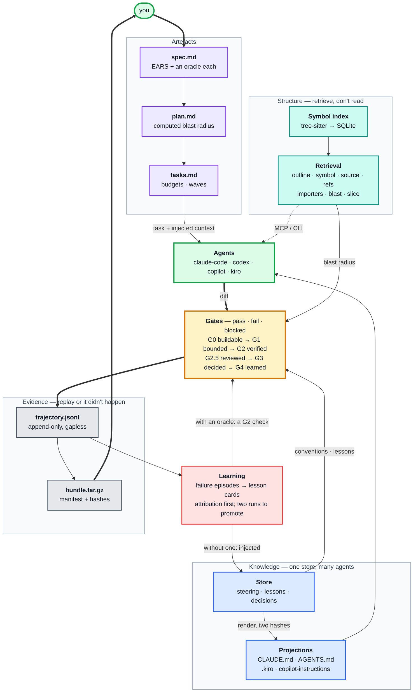
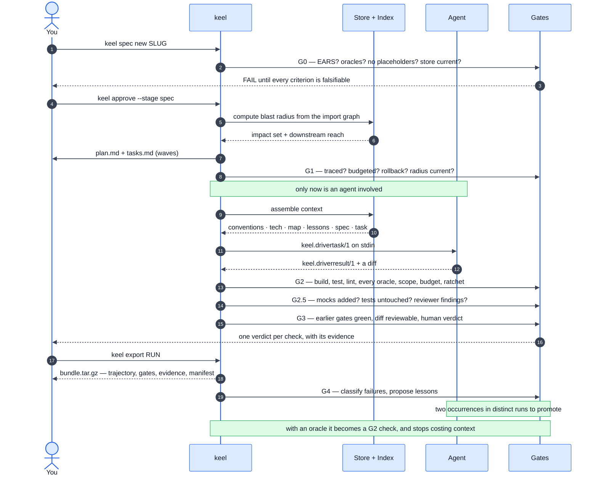

# keel

A gated harness for AI-assisted delivery.

**[daneb.github.io/keel](https://daneb.github.io/keel/)**

keel is a **conductor, not an agent loop**. It does not implement a model
adapter, a tool registry or an inference loop — Claude Code, Codex, Copilot and
Kiro already do that, and they will keep out-shipping any loop written alone.
keel sits above them and owns the two things none of them give you:
**auditable stopping conditions** and **durable memory across tools**.

New here? Start with **[GETTING-STARTED.md](GETTING-STARTED.md)** — about ten
minutes. The full design is [PLAN.md](PLAN.md), what is deferred and why is
[ROADMAP.md](ROADMAP.md), and the decisions that had a real alternative are in
[`.keel/store/decisions/`](.keel/store/decisions/ADR-0000-index.md).

---

## Architecture

Six components. The spine — the artefact schemas and the gate contract — is
small, versioned and additive-only; everything at the edges is a subprocess
speaking JSON.



| | Component | Owns | Fails loudly when |
| --- | --- | --- | --- |
| | **Knowledge** | The canonical store and its generated projections | A projection is hand-edited, or a shared store cannot be found |
| | **Structure** | The symbol index and the seven retrieval queries | The index is stale — answers are labelled `ripgrep` |
| | **Artefacts** | Spec, plan, tasks | A criterion has no runnable oracle |
| | **Gates** | Every verdict, with its evidence | A stage advances without one |
| | **Evidence** | The append-only trajectory and the export bundle | A verdict cannot be reproduced |
| | **Learning** | Failure classification and lesson promotion | A lesson is promoted without a rule, or decays unused |

---

## A run, end to end



---

## The seven principles, and what enforces them

PLAN.md argues these from the literature. This is what each one *is* in the code.

| | Principle | Mechanism | Fails when |
| --- | --- | --- | --- |
| P1 | Gates, not virtue | `gates/*.json`, `keel.gate/1` | A stage advances without a verdict |
| P2 | One store, many agents | Store + adapters + two hashes | A projection is hand-edited |
| P3 | Prose is not an oracle | `oracle:` on every criterion | A criterion has no runnable check |
| P4 | Retrieve, don't read | Index + seven queries + budgets | A budget is exceeded, or a big read is unjustified |
| P5 | Replay or it didn't happen | `trajectory.jsonl` + bundle | A verdict cannot be reproduced |
| P6 | Learn at the tail | Taxonomy + promotion rules | A lesson is promoted without a rule |
| P7 | Plugin edges, stable spine | Three subprocess contracts | A plugin needs a spine change |

---

## Design properties worth knowing

**Two hashes, not one.** Every projection carries `store=` and `body=`. That
separates *stale* (re-render) from *DRIFT* (a human edited a generated file, so
refuse and reconcile). Conflating them is how single-store designs lose work.

**`blocked` is a real verdict**, with its own exit code (3). It means the check
could not run — missing tool, no index, no credentials. It never silently
passes, and it is never recorded as the agent's fault. A gate with no checks is
`blocked`, not `pass`.

**Budgets are invariants.** Every generated artefact is fitted to a hard line
budget, with the truncation notice paid for *out of* the budget. Trimmed content
is deferred, never deleted — each cut carries a pointer to the full text.

**Approvals bind to a hash.** Edit a spec after sign-off and G1 fails with
`spec changed after approval`. Otherwise "approved" is a stamp inherited forever.

**An enforced lesson stops being a prompt.** A lesson with an oracle compiles
into a G2 check carrying `from: L-nnnn` — so "why does this check exist?"
answers with a lesson id, which answers with run ids. It is then *not* injected:
spending context restating a rule that cannot be violated defeats the point.

**The index is an accelerator, never a dependency.** Absent, stale, or an
unsupported grammar: every query falls through to ripgrep and *says so*.
Degrading from symbols to grep silently is how an agent ends up confidently
wrong about a codebase.

---

## Measured, not claimed

```
task                                              retrieval       read   ratio  recall
What is the public surface of the projection …          574       2588    4.5×    100%
Where is `store_hash_with_shared` defined and…          108      12203  113.0×    100%
What breaks if the Paths type changes?                  583      15709   26.9×    100%
How does a gate verdict get recorded?                   878       5861    6.7×    100%
What does the failure classifier do with a bl…          850       7414    8.7×    100%
total                                                  2993      43775   14.6×    100%
```

`keel bench` compares retrieval tokens against the tokens of the file reads that
would otherwise answer the same five fixed questions — both sides, same
estimator, your machine, now. No vendor numbers. It measures **cost**; recall
says the saving is not bought by answering less. It does not measure whether a
model would then answer correctly, and says so.

Other numbers: `keel map` indexes 5,705 files in **1.25 s** (39 ms incremental).
Four driver adapters across four different CLI shapes, **zero** schema changes.

---

## Commands

```bash
# Store and map
keel init                     # scaffold, seed, build the first map
keel map                      # rebuild the index and generated maps
keel store render / check     # project the store; report drift and staleness
keel doctor                   # is the whole harness in working order?

# Pipeline
keel spec new <slug>          # scaffold a spec, then run G0
keel gate g0|g1|g4 [slug]     # run a gate, record the verdict
keel plan <slug>              # compute the blast radius, scaffold plan + tasks
keel tasks                    # the plan as dependency waves
keel approve <slug> --stage spec|plan|merge
keel run <slug>               # drive an agent, capture evidence, gate it
keel run <slug> --waves       # one worktree per task, wave by wave
keel run <slug> --no-driver   # gate the working tree as it stands

# Retrieval
keel outline|symbol|source|refs|importers <target>
keel blast 'src/api/**'       # what else does this change touch?
keel slice T-1                # everything one task needs, budget-fitted
keel mcp                      # the same queries over MCP, on stdio
keel bench                    # measured token drop vs reading whole files

# Evidence and learning
keel replay <run> / keel runs / keel runs --prune
keel export <run> / keel export --verify <bundle>
keel learn / keel failures / keel lessons
keel lesson promote|reject|demote
keel metrics                  # pass rates, failure classes, tokens, gate theatre
keel ratchet                  # metrics that may improve and must not regress

# Drivers
keel driver list / keel driver check [id]
```

---

## Extending it

Three subprocess contracts, all JSON, all language-agnostic.

| Extension | Contract | Add one by |
| --- | --- | --- |
| **Gate check** | prints a `Check` on stdout | `[[gate.G2.check]]` in `keel.toml` |
| **Agent driver** | `keel.drivertask/1` in → `keel.driverresult/1` out | a ~40-line adapter + `[[driver]]` |
| **Reviewer** | `keel.reviewrequest/1` in → `keel.reviewresult/1` out | `[review]` in `keel.toml` |
| **Shared store** | another repo's `.keel/store` | `[[shared]]` — path or submodule |

`keel driver check <id>` runs any driver through conformance probes in a
**scratch repository**, never your tree.

---

## Languages

Rust, Python, JavaScript, TypeScript/TSX, Go, Java — via tree-sitter. A file
that will not parse is still indexed as metadata; a grammar whose queries stop
compiling is named in `keel map` output rather than silently yielding nothing.

## Status

**359 tests · 0 clippy warnings · macOS.** All five phases of PLAN.md.

Honest limits before you trust it: G2's *green* path is under-exercised (11%
pass across 18 runs, because keel was developed inside keel), and every number
here comes from keel measuring itself in one session. See
[ROADMAP.md](ROADMAP.md#known-weak-spots).

## Licence

Dual-licensed under either of

- Apache License, Version 2.0 ([LICENSE-APACHE](LICENSE-APACHE))
- MIT licence ([LICENSE-MIT](LICENSE-MIT))

at your option. Unless you explicitly state otherwise, any contribution
intentionally submitted for inclusion in the work by you shall be dual-licensed
as above, without any additional terms or conditions.
